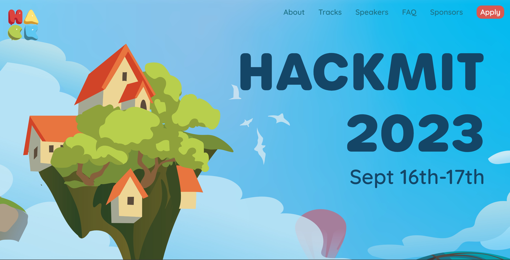
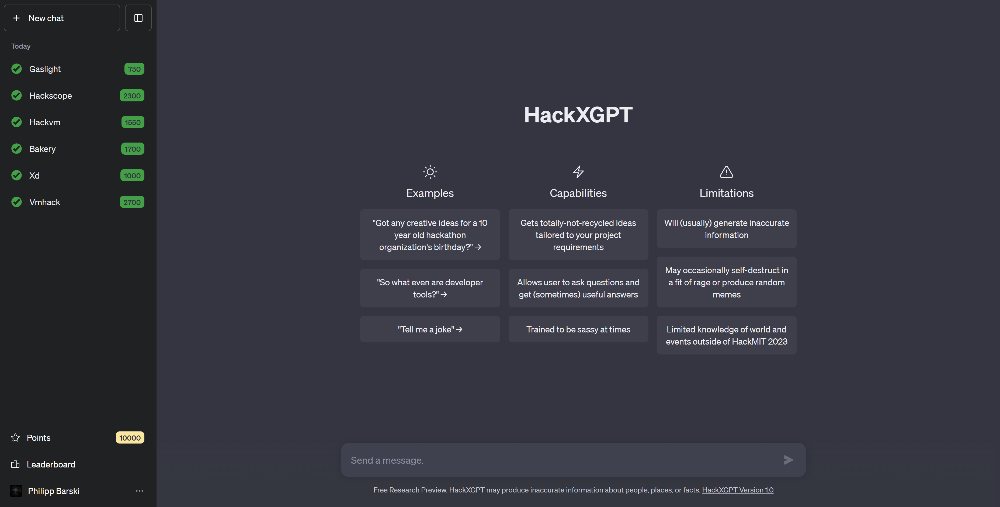

# HackMIT 2023 Admission Puzzle

## Introduction

HackMIT is an annual hackathon that takes place at Massachusetts Institute of Technology in Cambridge, Massachusetts in early fall. This year, 2023, one way to get automatically admitted was to collect points by *individually* solving CTF-like admission puzzles and finish in the Top 50 of hackers. I managed to complete all of the puzzles and will try to assemble step-by-step approaches and solutions for people that want to have an understanding or a deeper understanding of that type of challenges in general and provide a complete walkthrough from the first time seeing the website to solving the last puzzle.
## Format

I will be presenting all the solutions in a specific format, which is supposed to represent a sped-up version of my train of thoughts while tackling the specific problem. There will be sections that dive in a little deeper, which you can unfold. The problems that required code to be written additionally include a code branch. I will be embedding tips or recommendations which are supposed to prevent possible mistakes, difficulties or unnecessary excessive time-consumption while working on the respective problem. For some problems, I will add a logs folder that contains text that'd be too long to be put onto the explication.

Show Format
 

|     Step     |   Name     |      Description    |
|   :--       |    :---    |     :--       |
|      1    |   **First glance**      |     The prompt, description, text or image that initiated the challenge.  |
|      2    |     **First thoughts**    |     Here, I will explicate my intuition when I first faced the problem.        |
|      3    |     **First steps**    |      Sometimes, the most difficult thing is to start. Here, I will show a way how to.       |
|      4    |     **Implementation**    |     After those first steps, it should make sense or even seem simple. I will convert the previous thoughts and steps into a real program / apply them.        |
|      5    |     **Conclusion**    |     I will briefly summarize what we have achieved and learnt.        |

> **Important**
> Note that I didn't specify any prerequisites. I will indeed try to make the approach clear, regardless of the person reading this.

> **Warning**
> While I will always explain every bit, I highly encourage you to do some <u>in-depth research</u> about and assemble projects within topics that were unknown to you before, as this is the only way to make what you have learnt long-term memorable.

## Challenges

The first interesting thing you noticed after having visited the [endpoint](./gifs/main_page.gif) is a dodgy-seeming FAQ question and a hidden link which introduce the [entrance puzzle](/entrance_puzzle/). Solving this puzzle led to a ChatGPT themed command center which consisted of following problems.

| Number   | Challenge                                                                       | Points |
| :-----   | :----------------                                                               | -----: |
|    1     | [Gaslight](/gaslight/) – Convincing an LLM (Social Engineering)                 |  750   |
|    2     | [Xd](/Xd/) – Finding your way in a number cluster                               |  1000  |
|    3     | [Hackvm](/hackvm/) – RISC-V32 & x86_64 ELF Reversing (memcmp vulnerability)     |  1550  |
|    4     | [Bakery](/bakery/) – Web-App file upload vulnerability                          |  1700  |
|    5     | [Hackscope](/hackscope/) – Web-App JWT authentication bypass                    |  2300  |
|    6     | [Vmhack](/vmhack/) – RISC-V32 & x86_64 ELF Reversing (self-generating code, z3) |  2700  |
|          | Sum | 10000|

> **Note**
> Even though I recommend walking through the problems in the order I provided them, this is not necessary as they all are independent from each other.
> Still, there will be links in each of the puzzles to the respective next one in order which simplifies navigation.

## The End

## Statistics

For the curious ones, the overall official puzzle statistics, published in the [HackMIT live-stream](#see-also). You'll find them [here](./Statistics/README.md).

## Conclusion

Thank you to the developer team of HackMIT for those great puzzles. I hope you, dear reader, could take something with you, whether you were looking for challenges like the above, for previous HackMIT admission puzzles or were just interested. Thank you for taking the time, see you later! :wave:
## Issues

Anything missing? Typos? Enhancement ideas? Something you want me to explain more meticulously? Not happy? Just let me know, feel free to join the discussion, submit an issue or reach out.
## See also

[Official HackMIT solutions live stream](https://www.youtube.com/watch?v=FxIAzJU4lYs) – I really recommend checking it out.
## License

MIT License