# Xd – Finding the right path in an n-dimensional folder cluster with holes (DFS + Backtracking)
## First glance

 </br>

 </br>

A terminal! We can deal with that.
## First thoughts

The page in the upper pictures has the style of a terminal often used in Unix-Based-Environments. Let's try some basic commands such as `ls` and see where we are getting!
<details><summary>Show basic linux commands for this challenge</summary>

|Command name|Function|
|:--|--:|
|ls|List files in a directory|
|pwd|Print current working directory (current directory)|
|cd '_DIR_NAME'|set current directory to _DIR_NAME|
|cat '_FILE'|print out contents of _FILE|
|ls '_PATH_NAME'|list files in _PATH_NAME|
|when _DIR_NAME or _PATH_NAME are equal to '..'|Apply action to *previous* directory|
</details>

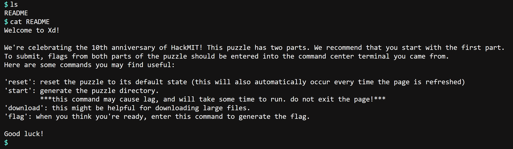

Interesting.

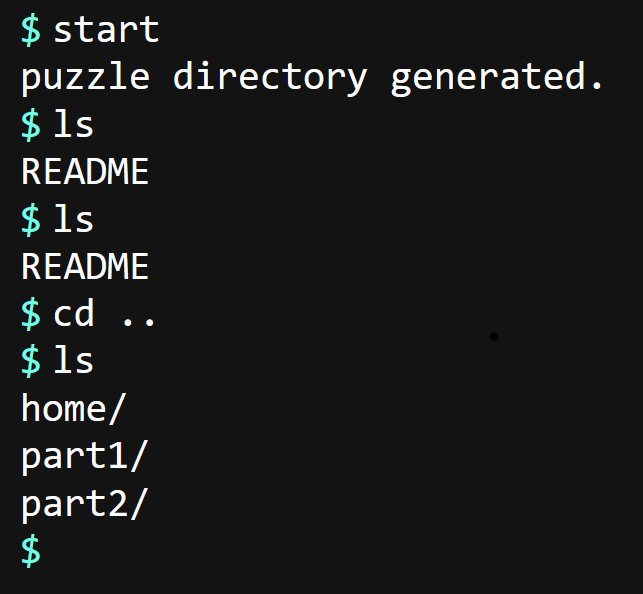

Apparently the puzzle is divided into two parts, part1 and part2. We can already assume that part2 will be harder than part1 and both depend on each other. Let's take a look at part1 first.

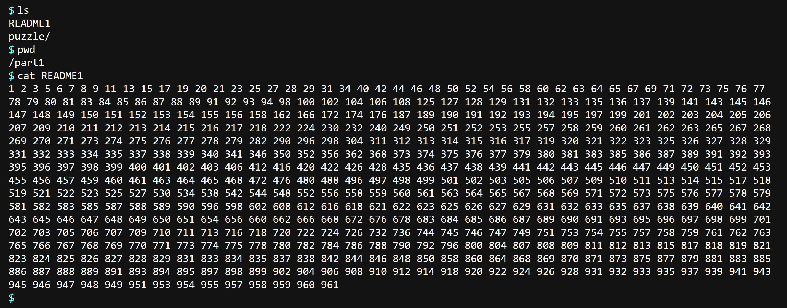

Oh, so part1 consists of a file called [`README1`](./logs/README1.txt) and of a directory called `puzzle`. The `README1` consists of a sequence of sorted numbers. Let's keep that in mind and explore the puzzle directory.

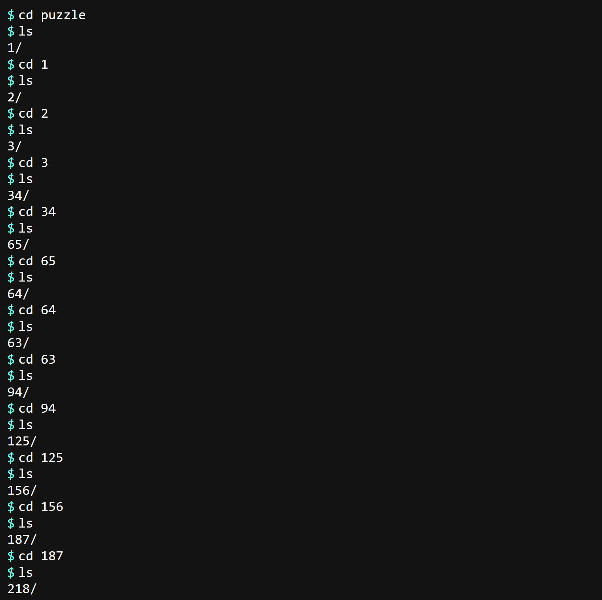

So, the folders are named by numbers. When we keep traversing, we soon come to the following point.
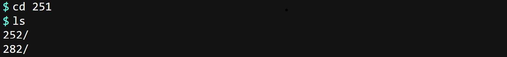
Oh no, now suddenly there are 2 folders to choose from (little spoiler: there will be many more choices where we can choose from up to 3 possibilities). Looks like a chall where we have to find patterns to find the right path in this cluster of folders. Let's examine the first folder names in our sequence.
```
1 2 3 34 65 64 63 94 125 156 187 218 249 250 251
```
They do look kind of consistent, don't they?

## First steps
Let's compare them with the first numbers from our `README1`.
```
1 2 3 34 65 64 63 94 125 156 187 218 249 250 251
1 2 3 5 6 7 8 9 11 13 15 17 19 20 21 23 25 27 28 29 31 34 40 42 44 46 48 50 52 54 56 58 60 62 63 64 65 67 69 71 72 73 75 76 77 
78 79 80 81 83 84 85 86 87 88 89 91 92 93 94 98 100 102 104 106 108 125 127 128 129 131 132 133 135 136 137 139 141 143 145 146 
147 148 149 150 151 152 153 154 155 156 158 162 166 172 174 176 187 189 190 191 192 193 194 195 197 199 201 202 203 204 205 206 
207 209 210 211 212 213 214 215 216 217 218 222 224 230 232 240 249 250 251 252 253 255
```
While the first three numbers are the same, after that the folder numbers seem to grow (but also shrink twice?) much faster. What is striking though is that, still, all first folder sequence numbers are a subset of the first pasted `README1` numbers! Let's take a deeper look and compute the distances between the numbers, and see whether we might find some pattern which would be a clear indicator of another clue for us to get closer to solving this puzzle.
```
Normal numbers: 1 2 3 34 65 64 63 94 125 156 187 218 249 250 251
Distances:       1 1 31 31 -1 -1 31 31 31  31  31  31   1   1
```
Not bad. Seems as though the numbers differ always by (at least for the first numbers) either 1 or 31. From that point, what you would do is, first, keep exploring (traversing through the folder cluster). You will notice following rules applied at all times for the numbers:
### Rules
1. They always are contained in the `README1` sequence.
2. The distances between two consecutive numbers are either 1, -1, 31 or -31.
3. When dealing with distances between those numbers, we always apply the same distance twice, i.e. add it twice. </br>
**Example**: Let's assume our distance sequence is `1 1 31 31`. Now we see a new distance being added, namely -1: `1 1 31 31 -1`. Because of rule 3 the next distance must be again a -1: `1 1 31 31 -1 -1`. What if our sequence is now `31 31 1 1 -1 -1 -31`? Next number is `-31`. What is the next number in a `31 31 31` sequence? The number of previous distances before the last `31` is even, so `31`.

Note that the last number in the `README1` is $961 = 31^2$. Also without knowing that 961 is a perfect square with square root 31, it might be straight-forward to assume that 961, the greatest number in the `README1`, is the number to which we have to get in the end after having traversed the folders.
## Implementation

Now, we do not have to do much more except implementing an algorithm that finds the right path to 961 and fulfills our rules. It should look approximately like this:
1. Start with the first number in our README1.
2. For the current number (which is the start number in the beginning) visit all neighbours (meaning numbers in our `README1` with either a distance of 1, -1, 31 or -31 (Rules 1 & 2)).
3. Mark already visited numbers as visited, because we don't want to visit them again and end up in an infinite cycle, dump invalid numbers. </br>
Note that rules 1,2 & 3 describe a special application of [DFS (Depth-First-Search)](https://en.wikipedia.org/wiki/Depth-first_search), where the graph is our `README1` cluster.
4. We add each distance twice and thus rule out invalid solutions (Rule 3).
5. If any of the next numbers isn't contained in the `README1` and not 961, we dump that same number. If all of the next numbers aren't contained in the `README1` and not 961, we [backtrack](https://en.wikipedia.org/wiki/Backtracking). That means that we're dumping this path because it doesn't lead to the end and using our previously found paths to find actually valid paths.
6. If we arrive at 961, print the path that led to the solution.
### Analogy Backtracking

Imagine you are trying to find a way out in a labyrinth. When all of the paths you checked close to you led to a dead end, what do you do? Aborting everything and going all the way to the start and trying it completely again from scratch? No, that would be inefficient, right? You are dumping those paths and checking the closest path to you that you didn't check yet and repeating the same process again. That exactly is backtracking.</br>

You can try to implement this yourself, the abstract concept of backtracking can just be added to the application logic by removing nodes (`README1` numbers) that you aren't dealing with anymore after you recursively searched (DFS) for solutions, with an origin of that to-be-removed node (and by returning after to the previous number / the previous stack frame).
### The algorithm

In my java algorithm I use sets to keep track of the `README1` numbers, because the time complexity of its search & write operations is O(1) (it's super fast). I also use a set for my already visited numbers, a linked set, because that is what preserves the actual order of the numbers which I need for the printing part after having found the solutions (normal HashSets don't do that; operations are still of the same complexity).</br>

Let's first read the file:

```java
// Reading file README1.txt
String readMeContent = new String(Files.readAllBytes(Path.of("../logs/README1.txt")));

// convert the string of whitespace (\s) of arbitrary length (+) separated numbers first to a stream of integers (Integer::parseInt) and afterwards to an unmodifiable set of ints
Set<Integer> numbers = Arrays.stream(readMeContent.split("\\s+"))
        .map(Integer::parseInt)
        .collect(Collectors.toUnmodifiableSet());

// visited numbers Set, a LinedHashSet, meaning it is a set but the numbers stay in their order
Set<Integer> visited = new LinkedHashSet<>();
```
We use following method header that keeps track of the current number (`currentNum`) in our `README1` sequence, the set of `README1` `numbers`, our already `visited` numbers and optionally the `repeatDistance` for rule 3, if we want to apply the respective distance twice:
```java
private static void solveProblem(int currentNum, Set<Integer> numbers, Set<Integer> visited, int repeatDistance) {/*...*/}
```
And now we just use some coding logic and apply our rules. If the currentNumber isn't contained in the `README1` number sequence or it has already been visited, dump the current paths.
```java
// rule 1
if (visited.contains(currentNum) || !numbers.contains(currentNum)) {
    return;
}
```
Mark the currentNumber as visited. If we have already reached the end, we print the current solution (we theoretically don't know yet if there are more than 1 solutions or even no solution). We additionally print the solution converted to the `cd` command with an argument of all the numbers in our sequence concatenated with a separator of `'/'`, i.e. the command that moves us from the puzzle directory to the directory where we found a (possible) solution.
```java
visited.add(currentNum);

if (currentNum == 961) {
    System.out.println("Found solution: ");
    // print solution
    System.out.println(visited.stream()
                .map(i -> i + "")
                .collect(Collectors.joining("/", "cd ", "")));
    return;
}
```
Now the main part. We use `repeatDistance` to check whether we have to repeat the distance from the previous number. If it actually is the case, then `repeatDistance` is not equal to zero. Then, we just call `solveProblem` recursively again with the next number being the to-be-repeated-distance added to the current number and a `repeatDistance` value for the next call of 0, meaning we don't repeat again in the next call after having just repeated. </br> If the current distance is not to be repeated (meaning `repeatDistance` == 0), then we check all valid numbers around us, i.e. numbers with differences to the current number of 1, -1, 31 or -31 (rule 2). We additionally pass a repeatDistance of the distance we just added to the respective number, because we want to repeat (rule 3) each distance.
```java
if (repeatDistance != 0) {
    // if the previous distance was a non-repeated distance or there was no distance before, repeat the previous distance again (rule 3)
    solveProblem(currentNum + repeatDistance, numbers, visited, 0 /*this is repeatDistance*/);
} else {
    // visit numbers with distances from current number in {1, 31, -1, -31}
    solveProblem(currentNum + 1, numbers, visited, 1);
    solveProblem(currentNum + 31, numbers, visited, 31);
    solveProblem(currentNum - 1, numbers, visited, -1);
    solveProblem(currentNum - 31, numbers, visited, -31);
}
```
After we're done checking all the possibilites with origin of the `currentNum` in the current recursive call, we remove `currentNum` from the visited numbers, i.e. we backtrack, remove the starting node of already visited paths from the result, and search through recent paths that we haven't searched yet.
```java
visited.remove(currentNum);
```
And that's it. Now we can call the method from our main method with a repeatDistance of 0, because we don't want to repeat any distance at first, the empty `visited` set and a current number (`currentNum`) of 1, the first number in our `README1`.
```java
solveProblem(1 /*currentNum*/, numbers, visited, 0 /*repeatDistance*/);
```
You can find the whole script [here](./code/Solution1.java). When we execute it (I use a java jdk with openjdk version "20.0.2" 2023-07-18), we get an output of:

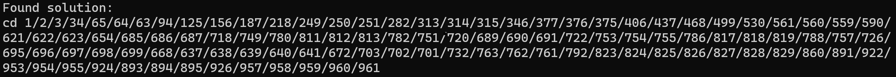

Great! Only one solution. Let's navigate to the puzzle folder and try pasting it.

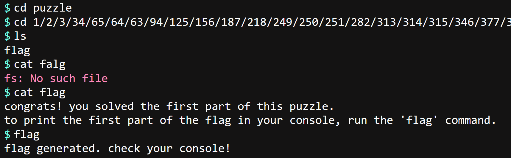

Nice! Let's check our java script console through browser tools.


Great. The first 32 hex digits of the puzzle flag. Don't fear `part2`! We already did most of the work.

> **Note**
> Part1 was supposed to be feasible completely without developing algorithms, but it'd take a minute+the time the terminal emulator needs to load for each `ls` to find the flag.

### Part 2

Navigating back by entering `cd` and into the part2 folder:

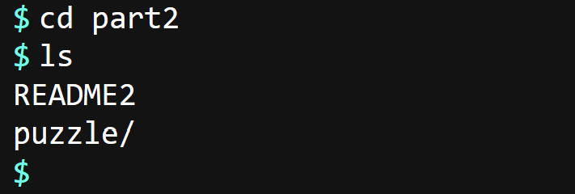 </br>

Part2 consists of a [`README2`](./logs/README2.txt) and a puzzle folder. The still sorted `README2` contains many more values than our `README1` and when traversing through the folders you might notice nodes with many more folder possibilities than we had before (up to 19 possibilites per node). Upon closer inspection, it becomes clear that rules 1 & 3 are still valid, just with the `README1` values exchanged with the `README2` values. This time the differences between the folder sequence numbers are $\pm$ powers of 5. The numbers in the `README2` are ranging from 1 to $9765625 = 5^{10}$, again, with holes in between. This implies that only powers of 5 with a max exponent of 9 are allowed as distances. So, we have valid exponents of powers of 5 from 0 to 9 merged with each of those powers negated, i.e. all in all 20 possible distances (we calculated the 19 back then as 20 - 1, as the folder node you came from will definitely not appear again in the next folder node you reach). That means rule 2 persists too, where we allow just those power-of-5-distances instead of 1, -1, 31 and -31 and a goal of again the largest number in our `README2`, 9765625. </br>
That means we can again use our algorithm, just with a modified README, modified distances and a modified goal number!! You can try modifying [it](./code/Solution1.java) yourself, or just click [here](./code/Solution2.java) to get to the modified algorithm.
> **Important**
> I copy-pasted the `Solution1.java` file and did some minor modifications. This is bad (*worst*) practice, don't do this at home.
<details><summary>Open-Closed Principle</summary>

We could have used the [Open-Closed Principle (OCP)](https://en.wikipedia.org/wiki/Open%E2%80%93closed_principle) here which would end up in making the code max. pretty and us not having to modify the `solveProblem` method at all for various rule 2 modifications. I didn't do that as this is out of the scope of this Write-Up.
</details>

We get following output.

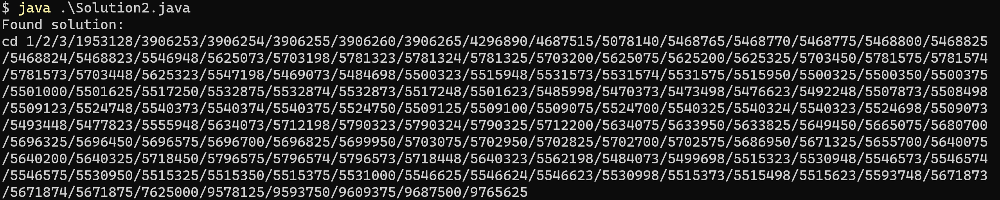

Great, again just one solution. When we paste this into our terminal emulator after having entered the puzzle directory, we get rewarded with a flag.

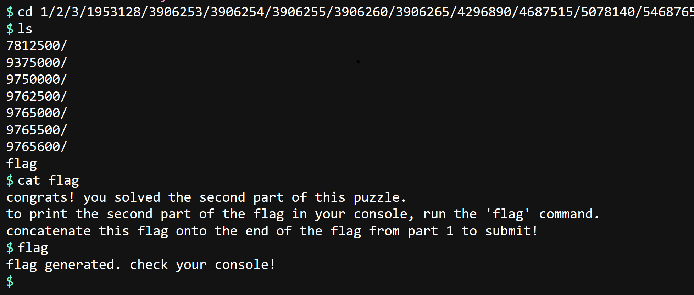

Taking a look at our js console again:

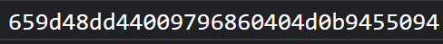

Great, we are done! We can concatenate the two flag segments now and submit them to the command center!
> **Note**
> This whole folder cluster can also be visually perceived as an n dimensional cluster of natural numbers with a few missing in between.
> The first part is a 2-dimensional 31 by 31 plane, where a few nodes are missing. Try to imagine. It basically is a labyrinth!
> The second part is a 10-dimensional 5 by 5 by 5 by ... by 5 object with missing nodes. Imagining this is hard, but the previous concepts still apply.

## Conclusion

We learned how to approach number-sequence puzzles where there are no instructions at all. We learned about the path-traversal algorithm DFS and the more advanced concept of backtracking which isn't as hard to implement as it seems at first! We learned that harder problems depend most times on easier problems and can be solved using these easier problems. In the end, we learned that not all components of a puzzle have to be understood to solve it, but may definitely be helpful to do so. I hope you could take something with you. And remember: the more you explore the intricacies of the respective puzzles and experiment, the more steps make sense. See you at the [next puzzle](./../hackvm/)!