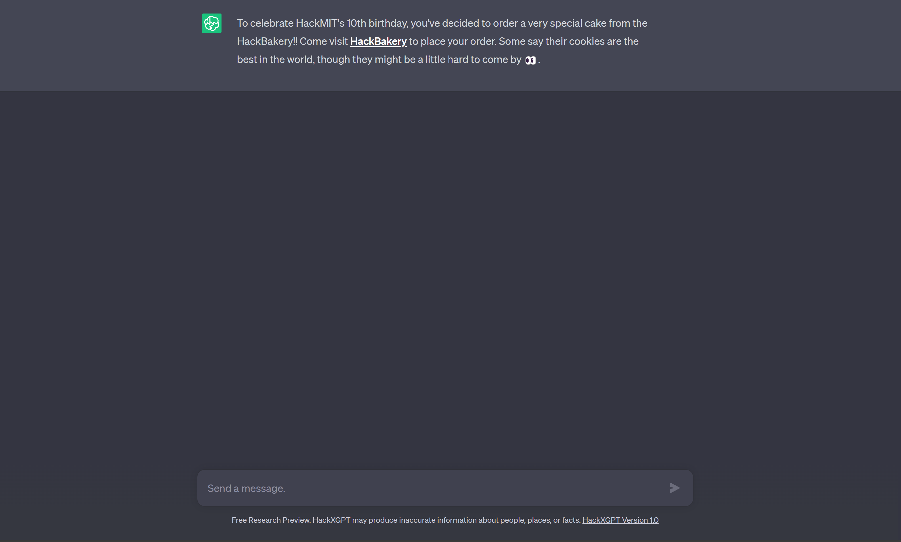
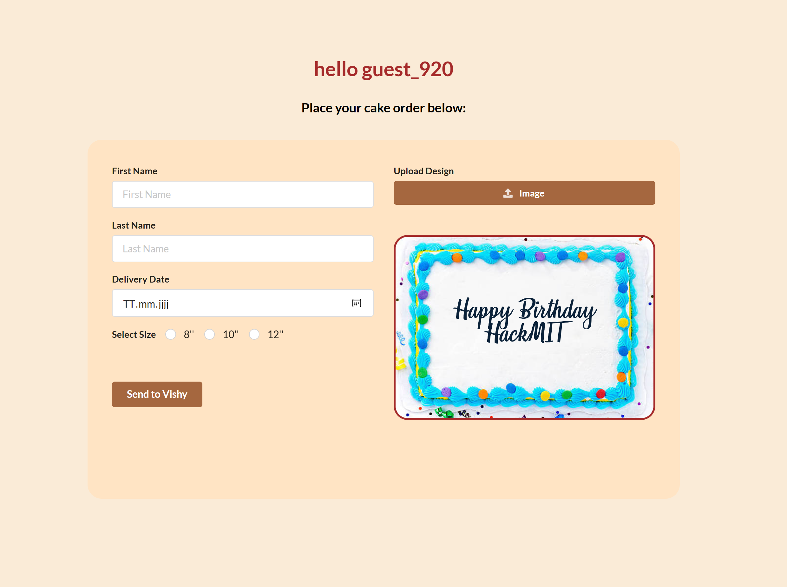
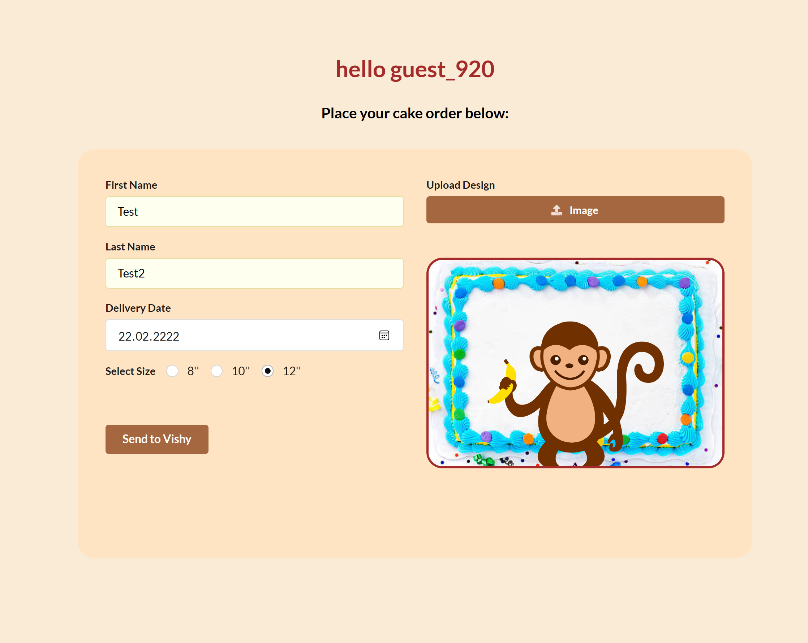
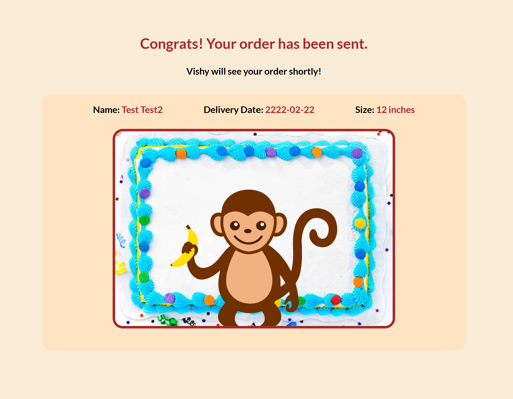
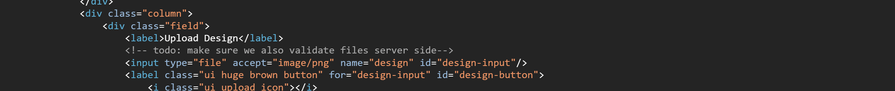
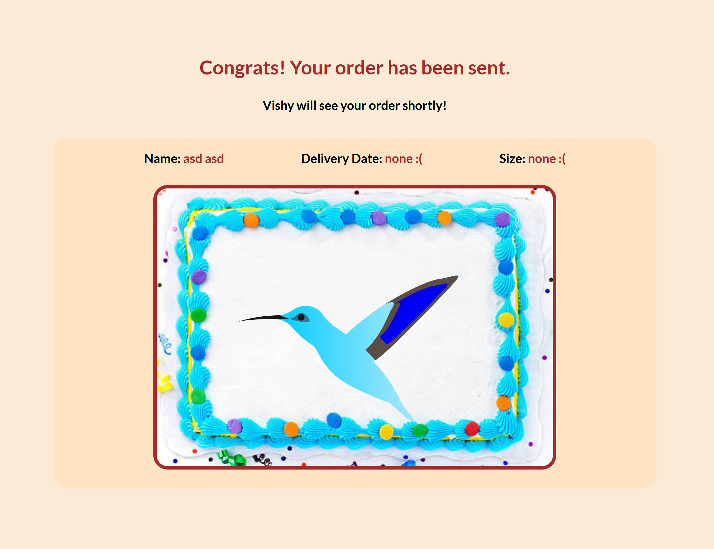
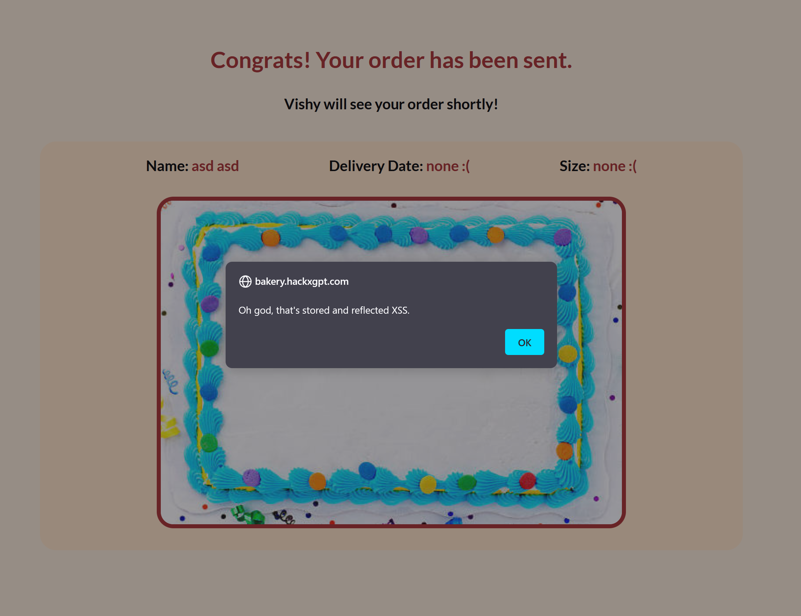
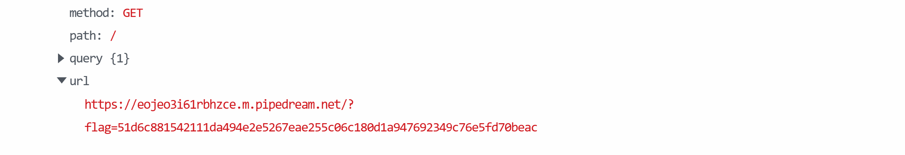

# Bakery – Stored XSS (special kind of image) file uploading vulnerability
## First glance


This will be a Web-App challenge!
## First thoughts
The first thing you should always try when first visiting a Web-App you want to test and with a possibility to take user input is arbitrary input. Let's enter something and have a look at the result. </br>
Arbitrary input: </br>
 </br>
Result: </br>
 </br>
Looks like we are getting redirected to a preview page. We can already assume that it is going to be kind of a file upload vulnerability. This challenge was again a challenge where the key was to experiment. A clue that we got from the prompt was that Vishies cookies would be hard to come by. "Cookies" might have different meanings, either the ones you buy in a bakery, or cookies on the web. On the internet, cookies are being used to keep track of the client, human or not. Example use cases are for example are controlling the actions and especially the amount of actions done by a specific user, tracking actions of end users or keeping a user <mark>authenticated</mark>. And that is probably what we are looking at. The hint is telling us to steal cookies from Vishy.
## First steps
As the very first step you might try out providing malformed image names and images and how the application works in the background, checking out the source code on the front end. We soon come to see an interesting comment in the main page html code.

So our suspicion was probably right. Its about the image files not being handled correctly. When we examine the how our data is actually being sent to the application, we will see just a POST-Request (basically a request to send data to the server) to the preview endpoint with all of our data html-form-encoded in the body. We can try some stuff out here like sending arbitrary files to the server, like php files. But what we get in that case is the following page returned:
```json
{
    "error": "file is not allowed"
}
```
Additionally, we can notice a header of `X-Powered-By: Express`, so we are dealing with a [node](https://nodejs.org/en) backend here. Apparently the classic image uploading vulnerabilities with embedded php in images or in parts of images also doesn't seem to work... Still, we are able to upload *any* files that are ending in png, whether they are valid images or not. We can write arbitrary content into the image files, but no content seems to be changing anything. So, are just png-files allowed to be dropped? Huh, apparently jpg-images work, too. I wonder what other kinds of images we might be able to drop here... When using [burp](https://portswigger.net/burp) to intercept requests and modify the image file name, we also seemingly cannot get to any success. All kinds of injections (maybe Vishies cookies are in a database??), php file upload vulnerabilities don't work. Huh. What about trying out some other image type? What image types do you know except png and jpg? After a while we might get the idea to try out svg-images. You'll see why. Let's download a random one.

Nice, that works! What do we know about SVG's? Well, they are internally represented by mark up. Is there any tag that could help us execute some code or do something similar? A hint: it starts with `s` and ends in `cript`. Yes, we can actually embed javascript in an SVG file. Let's try to assemble an SVG file that makes a call to `alert`. You can find a ready one [here](./code/first_payload.svg).

It works, the application is vulnerable to [XSS (Cross Site Scripting)](https://de.wikipedia.org/wiki/Cross-Site-Scripting)! But how do we actually get to Vishies cookies now, from here?
## Implementation
A not-to-be-underestimated part in Web-App-Pen-Testing is the question how to use a vulnerability that we found. I mean, the Web-App is vulnerable now. That's cool, but how can we profit from that? We know that the cookies of each user are stored by their browsers. That means, if Vishy will indeed see our order, we need to send his cookies somehow to us. How do we do that? Well, something that we control needs to be able to receive data on the internet. We can have or create our own server for that or use services such as [RequestBin](https://pipedream.com/requestbin) that just log incoming requests and their content for us to see. After having completed setting up our RequestBin endpoint, we can set up the SVG payload that just sets the document location to our endpoint and appends the cookie of the current document to the request, so that we will be able to see it afterwards in some arriving request. Let's pull this off. First uploading the new SVG [payload file](./code/payload.svg) to Vishies bakery. Now we are checking out our endpoint for arriving requests and...

Now we got the flag and are able to submit it to the command center. We are done with this puzzle!
## Conclusion
In this post, we learned about various ways to approach File Upload challenges and about how to look for vulnerabilities of this kind, about tools and techniques such as Burp Suite, Spidering, RequestBin, gathering information about Web-Apps, internal representation of SVG's, XSS, how to embed JavaScript in SVG files to exploit bad file validation and basics about HTTP-Requests. Great job! Feel free to check out the [next puzzle](./../hackscope/).