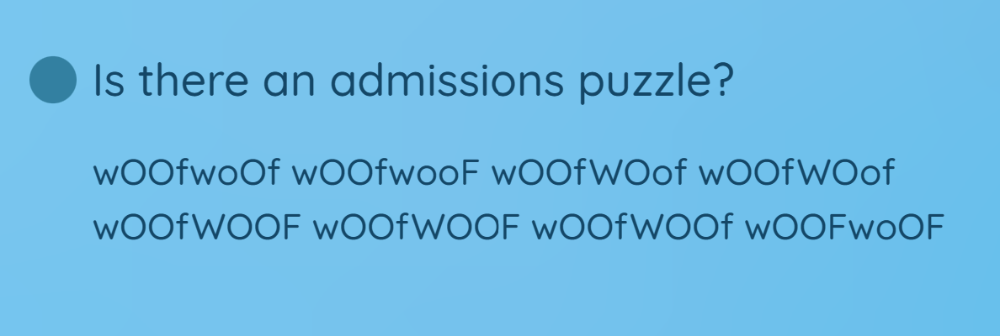
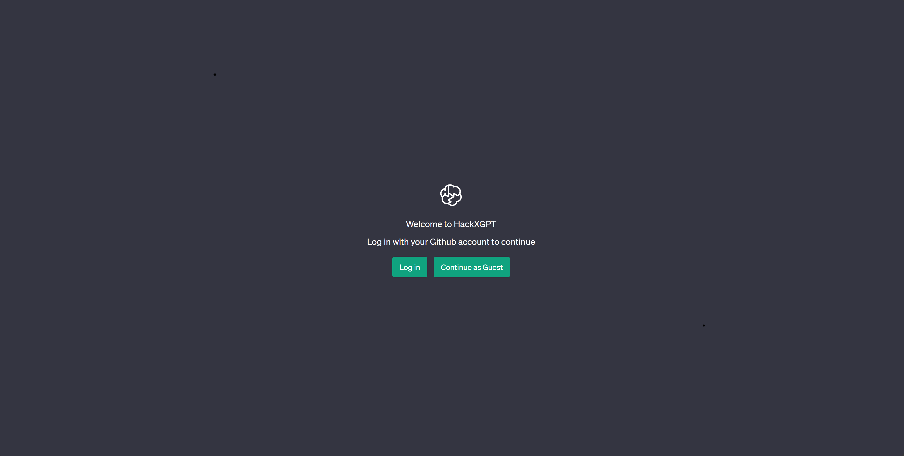
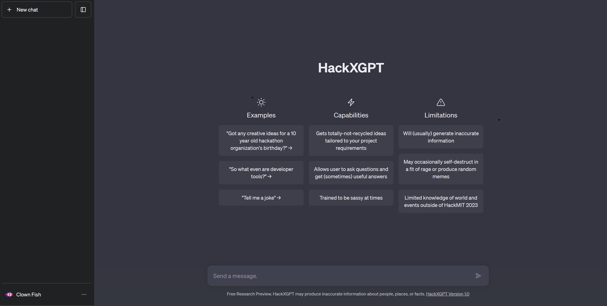
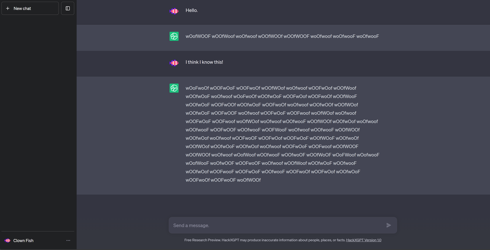

# The Entrance Puzzle – Decoding "woof-encoded" binary ASCII-codepoints
## First glance

The first thing I noticed when taking a look onto the main page was this interesting FAQ-question. 
## First thoughts
The first steps were individual, what I directly saw were the letter-groups of 8. Well, assuming that a secret message is trying to be conveyed here, is there some way how letters could be represented using this format, a constant size separation by spaces where the separated words just differ by their letter case? Maybe some way how computers encode characters? Might each letter case represent a 0 and a 1 aka a bit? How can 8 bits be converted to a character or what character encoding uses 8 bits? At this point you might just know the answer or do some quick research. The short answer is [latin1 / ISO-8859-1](https://en.wikipedia.org/wiki/ISO/IEC_8859-1) or [ASCII](https://en.wikipedia.org/wiki/ASCII) as a 7-bit encoding. <details markdown="1"><summary>Long answer</summary> </br>
In general there are many character encodings out there that map basic characters to one byte. ASCII (American Standard Code for Information Interchange) is one of the oldest and one of the most popular character encodings. It uses a lookup-table to map numbers (code points) to characters. The [hex](https://en.wikipedia.org/wiki/Hexadecimal) code point range 0x30 – 0x39 represents for example the numbers 0-9 and the ranges 0x41 – 0x60 and 0x61 – 0x80 represent the character ranges A-Z and a-z, respectively. It is indeed useful to memorize those ranges(easier to memorize in hex than in the decimal system) to write applications that do some sophisticated character comparison, concatenation, generation or whatever you can think of. Try to write a random alphanumerical character string generator, of length $n$ (for example `'aI279Ah2K8sekQsB2'` might be a valid output string where $n = $) In programming languages, you are able to cast (convert) those code points directly into characters. For example, converting the 0x41 ASCII-Codepoint into `'A'`: </br>

Java or C#
```java
char c = (char)0x41;
```
Python
```python
c = chr(0x41)
```
Ruby
```ruby
c = 0x41.chr
```
PSL (Powershell)
```powershell
$c = [char]0x41
```
JavaScript
```js
c = String.fromCodePoint(0x41)
```
C or C++
```c
char c = 0x41;
```
Languages that don't allow arbitrary conversion of types are called type-safe languages. Java as a type-safe language still allows implicit conversions, for example `float f = 2;`, where an integer gets implicitly converted to a float. On the other hand, the float-integer conversion relation isn't mutual in Java, you cannot do following: ~~`int i = 2.3;`~~ </br>
<details><summary>Even more</summary></br>

The ASCII encoding generally uses all code points from 0-127, all in all 128 or $2^7$ code points, that means they can be represented using 7 bits, even though, because types are 8-bit aligned in general (nowadays), programming languages use 8 bits to represent an ASCII-character (or even more, but that is out of the scope of this Write-Up). ISO-8859-1 or also sometimes referred to as latin1 offers support for some more characters, including accented characters and [umlauts](https://en.wikipedia.org/wiki/Umlaut_(diacritic)). Most programming languages nowadays support modern Unicode Transformation Formats (UTF) such as UTF-16 that support a much wider range of characters that have to be represented using multiple bytes. Encodings are called ASCII-compatible if the first 128 codepoint-mappings (first characters sorted by codepoint value) of the respective encoding are identical to the ASCII-codepoint-mappings. New versions of modern programming languages also at most times include a variable-width encoding, which saves space by storing sets of characters (that have a specific relation) with the smallest possible byte-per-character count of the character with the highest codepoint.
</details></details> </br>

## First steps

Intuitively lowercase characters represent zeros and uppercase characters represent ones. That means a letter composition such as `wOOfwooF` is translated to `01100001`. You can just use a programming language to convert this bit composition to a character or an ASCII-Table. For example, a oneliner in python:
```python
print(chr(0b01100001))
```
Output:
```text
a
```
This means `wOOfwooF` represents the character `'a'`!!
> **Note**
> There is a tool out there called [CyberChef](https://gchq.github.io/CyberChef/) which automates decoding-problems like this and a whole lot more which might save much time as no code is required to be written. Check it out!
### Passphrase

---
 Let's just assume that this will work for every character of our original FAQ question. You can manually decode `wOOfwoOf wOOfwooF wOOfWOof wOOfWOof wOOfWOOF wOOfWOOF wOOfWOOf wOOFwoOF` for each 8-bit-character composition with python (on your terminal). *Try it!* You'll result in: <details><summary>Show solution</summary>balloons</details>

How exciting, right? Wait, does that mean we're done?
### Command center

---
> **Important**
> Don't ever assume (or rather hope) that such puzzles are over after a short amount of time or work. At most times, if rules aren't clearly set and you find yourself in an ambiguous state of continuation (meaning you don't know what to do next), you either missed something (often obvious) or haven't done enough.

When taking another look at the [main page](./../gifs/main_page.gif) you might ask yourself, why do our encoded binary letters actually consist of "woof's" and why was the character sequence we just decoded equal to [the word](#passphrase)? There are objects (and dogs) at the bottom of the page that fit those thoughts. After some trying out and arbitrary clicking you might have gotten to the point, where


Now, that is an unambiguous clue, a hidden link. That link introduces a GPT-themed command center where you are provided with the option to chat with "HackXGPT".





Note that I logged in as a guest as I already completed the puzzles on my github account.
### The Chat

---
Once you start chatting with HackXGPT you'll come to notice something.

Aren't those our woof-encoded ASCII-characters?! We already know how to decode this. 
## Implementation

For the sake of time, you might be inclined to write a simple python script that takes a blob of "woof-characters" as an input and returns the decoded text.
```python
def solveProblem(str):
    for s in str.split(" "):
        cur = ""
        for c in s:                     # for each woof-character: convert upper- and lowercase characters to a 1 and 0, respectively
            if c.isupper():
                cur += "1"
            else:
                cur += "0"
        print(chr(int(cur, 2)), end="") # convert the binary string to an int with base 2, the int, according to the ASCII-table, to a char and print it
    print("")

yourBlob = "_PASTE_BLOB_HERE"
solveProblem(yourBlob)
```
You'll find the complete program [here](./code/EntrancePuzzle.py) and additionally a [java oneliner](./code/EntrancePuzzle.java) solution for fun. The not-decoded woof-blocks are located [here](./logs/chat_woofs.log).
After decoding and sending some more messages you'll get following decoded answers.
```text
Oh no !!
Rurl the Retriever flew up, up, and away and stumbled upon HackXAI's headquarters.
In order to make it back in time for HackMIT's 10th birthday, you need to help Rurl solve a series of challenging puzzles.
If you accept this challenge, enter Rurl's passphrase!
```
A passphrase?! We've come so far, what else do we have to do? :wink: Remember that we already decoded something in the beginning, the FAQ-woof-characters! That's our [passphrase](#passphrase).


Congrats! Now, we have solved the complete entrance puzzle and have arrived at the command center. Take a sip of tea, coffee or whatever you like.

## Conclusion

In this entrance puzzle, we learned about bits and bytes, how characters are represented to a computer on a basic level and the character encodings ASCII and latin1, about the ASCII-table, how to approach and tackle decoding challenges and about automating those without writing code in the future with [CyberChef](https://gchq.github.io/CyberChef/), about how to implement similar decoding processes in python, about not being too jumpy, speedy or impatient during challenges and hopefully about the excitement and fun you can have while solving puzzles. Either way, I hope you could take something with you, see you at the next puzzle! Visit the [next puzzle](./../gaslight/).