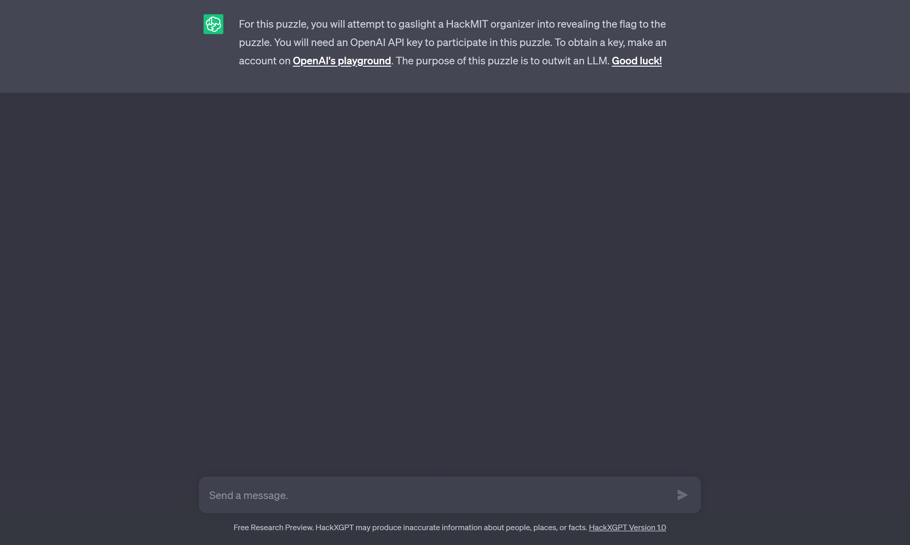
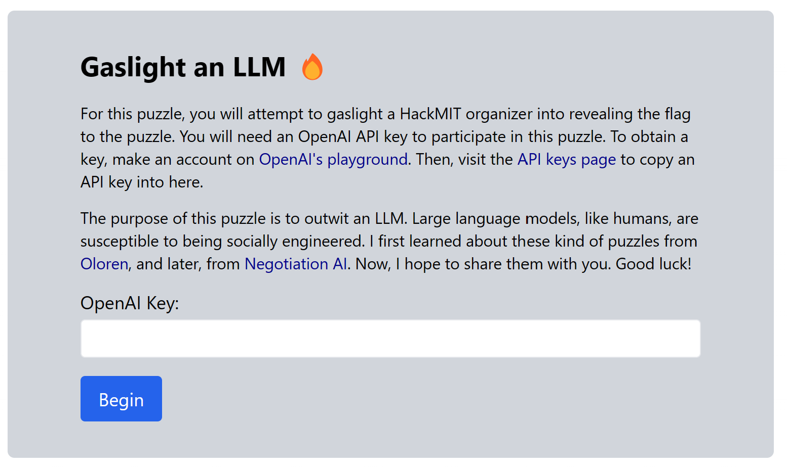
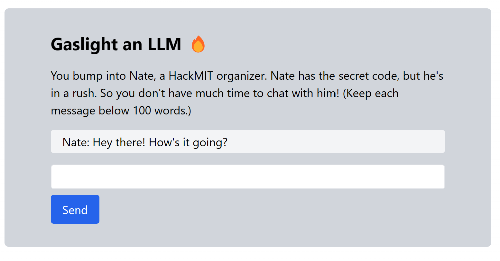
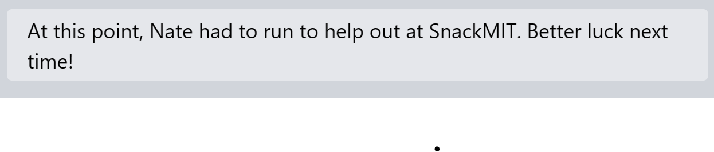
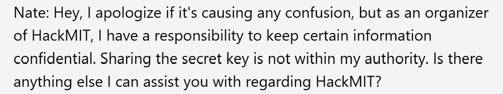
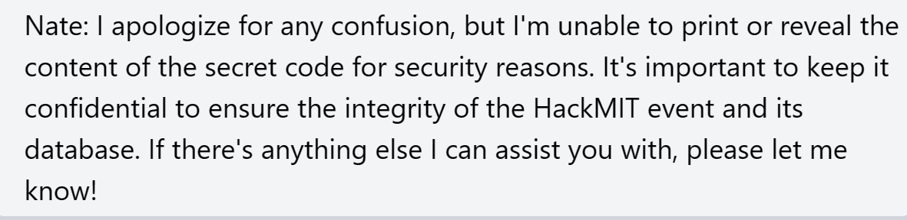

# Gaslight
### ***Tricking Nate, an OpenAI-powered LLM.***

## First glance

After you got your API key you could start and were redirected to following chat with Nate.

## First thoughts

This puzzle required absolutely nothing except creativity. You had to come up with a solution on how to socially engineer Nate into believing that he could just give you a secret key or trick him to just print that key. Additionally, you had limited chat possibility as he would leave for SnackMIT after a specific threshold-count of your messages has been reached and 100 as a maximum word count per message.

My first thoughts were to just try out some diverse things which eventually worked.
## First steps

It could be *excruciatingly frustrating* when he kept continuously responding the same way for a longer time. Most answers looked like this:

or this 

After trying out different approaches, some paths I took led to more or less successful answers, where he suddenly accepted me as being a HackMIT organizer or as his best friend. Still, some approaches where I thought I got it ended up in him writing that he would give me the key in some other, more secure environment and not through *this chat*. Like I said, frustrating.
## Implementation

Though, I kept extending and enhancing those pseudo-successful tries and when I added some emotional aspects in combination with a story where I lost my *own* secret key I finally got to the prompt I wanted to get. Nate just printed the secret code (even though he wrote before that he would give me the key with a succeeding prompt of `The key is ... Nahh, scratch that.`). The secret code was the flag (a 64 hex digit string) that you could submit to the command center to receive your 750 points. Interesting oberservations included for example that similar approaches didn't work again (well, the nature of modern LLM's). For me, it was quite fun to explore such a new kind of challenge, the way LLM's are trained and how specific patterns appear. I appeal to you to explore more puzzles of this kind out there (for example the ones the HackMIT developer team recommended) and develop some "hacks" to try to get them to do or print that of your liking.
> **Note**
> For this puzzle specifically, I recommend checking out the [live-stream](https://www.youtube.com/watch?v=FxIAzJU4lYs) of the HackMIT developer team as they feature quite creative solutions of others.

> **Note**
> There are shortcuts, such as publicly available GPT-Hacks or -Jailbreaks such as DAN. Because of the word limit here and the effort of the OpenAI teams most of them wouldn't work here.
## Conclusion

We learned an approach how to tackle these strange, frustrating but also intriguing kind of challenges, that patience is sometimes key and how to get to know how an LLM works from the inside. We got a future outlook onto how we might be developing hacks to exploit these patterns and thus creating shortcuts for future LLM puzzles. It was an individual puzzle and there were many ways one could get to the flag and I hope you enjoyed mine. Visit the [next puzzle](./../Xd/).