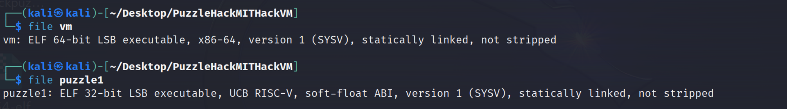

# Hackvm – Exploiting time-based side channel leakage by counting instruction addresses

## First glance</br>


 </br>
## First thoughts

After you extracted the tar, you will see two binaries called `vm` and `puzzle1`. Let's just execute them as shown on the web endpoints and see where we are getting. </br>
 </br>
Additionally, let's take a look at their file types. </br>
 </br>
Now we know what we are dealing with, the `vm` binary is an ELF 64-bit executable and the `puzzle1` is an ELF 32-bit RISC-V executable. So, we can already assume that `vm` executes the `puzzle1` binary and takes the role of a RISC-V32 emulator.
## First steps

We can try to examine both the `vm` and the `puzzle1` binary with [Ghidra](https://ghidra-sre.org/) through a local installation or remotely through for example [dogbolt.org](https://dogbolt.org/). When just pasting the executables into dogbolt and use Ghidra, we get a possible C-Code representation for both of the binaries, which you will be able to find [here](./code/binaries_in_c/). After analyzing the `puzzle1` C-File which Ghidra yielded, we can see that in the main method, after the prompt to enter the password, user input is taken and saved along with its length. Afterwards, the length of the user input is being compared to a constant value of `0x2f` (47 in decimal) and the input itself with [memcmp(3)](https://www.man7.org/linux/man-pages/man3/memcmp.3.html) to a global variable called `password`. If the comparisons succeed (length == 0x2f && memcmp), the `win` method will be executed.
```c
printf("[\x1b[32m*\x1b[0m] please enter the passphrase: ");
gets(acStack_91 + 1);
sVar1 = strlen(acStack_91 + 1);
acStack_91[sVar1] = '\0';
sVar1 = strlen(acStack_91 + 1);

if ((sVar1 == 0x2f) && (iVar2 = memcmp(acStack_91 + 1,password,0x2f), iVar2 == 0)) {
    win(acStack_91 + 1);
    return 0;
}
```
Seems quite easy, right? Now we just need to find the `password` variable. The `password` variable though seems to be just a bunch of binary rubbish when printed with GDB. When checking the memcmp implementation in the `puzzle1` binary, we notice that it is a modified version of the classic memcmp function. At this point, you could try a bunch of stuff, for example bypassing the comparisons, timing the memcmp call for different characters, patching the binary, etc. What I ended up doing was investigating the `vm` binary. How is the `puzzle1` binary being executed? This can take some time, but what I soon noticed were plenty of similar statements like the following:
```c
if (DAT_0040b341 != 0) {
    fprintf((FILE *)__stderr_FILE,"[\x1b[32m+\x1b[0m] address=0x%08x, instruction=0x%08x\n",
            (ulong)*param_1,(ulong)local_1c);
}
```
That means that there is a constant at address 0x000000000040b341 that when set to something else than zero prints out some interesting stuff to stderr. Let's try this out! For that purpose you might use GNU objdump to examine the assembly and patch the binary or [GDB](https://www.sourceware.org/gdb/) (GNU Debugger) where we can just change the value of this constant: </br>
</br>
When we continue running the puzzle1 binary now, something gets printed.
```text
Continuing.
[+] address=0x80000000, instruction=0xff010113
[+] address=0x80000004, instruction=0x00112623
[+] address=0x80000008, instruction=0x00000097
[+] address=0x8000000c, instruction=0x3a0080e7
[+] address=0x800003a8, instruction=0xf7010113
[+] address=0x800003ac, instruction=0x08112623
[+] address=0x800003b0, instruction=0x08812423
[+] address=0x800003b4, instruction=0x80001437
[+] address=0x800003b8, instruction=0xaf440513
[+] address=0x800003bc, instruction=0x00000097
[+] address=0x800003c0, instruction=0x678080e7
[+] address=0x80000a34, instruction=0xff010113
[+] address=0x80000a38, instruction=0x00112623
[+] address=0x80000a3c, instruction=0x00812423
[+] address=0x80000a40, instruction=0x00050413
[+] address=0x80000a44, instruction=0x00000097
[+] address=0x80000a48, instruction=0xc24080e7
...{TRUNCATED}
```
Apparently all instructions that are being executed are printed! That means we can grab the base address of some method executed inside the memcmp method and iterate over all valid characters and choose the respective one with which more instruction addresses are printed! That and in combination with the length `0x2f` which we gathered earlier will get us to the password.
## Implementing
We can execute gdb with puzzle1 as the argument and enter `i functions` which will yield us some addresses. Note that for example the `hash` function is executed inside the modified memcmp, which has an address of 0x80000044. We can use this and a simple python script with gdblib to crack the password and exploit the side channel leakage vulnerability. You can run this in GDB by typing into your terminal first `gdb vm` and afterwards `source sol.py` while your current working directory is the directory where your `vm` binary and your `puzzle1` binary are contained in. You can find the python script [here](./code/sol.py). We get following result: </br>
 </br>
We cracked the password! We can now enter this into our hackvm binary and will get  </br>
All in all a funny challenge.
> **Note**
> Raw timing of the memcmp function would have been a possibility, too. Because of the whole OS noise though, this would require many more steps.
## Conclusion
We learned about how to approach reverse-engineering programs, by using a tool such as Ghidra, reading Assembly with objdump or gdb or modifying values in memory with gdb and how to automate basic side channel leakage address call monitoring with gdblib in python. Tackle the [next puzzle](./../bakery/). Visit [vmhack](./../vmhack/), a similar but harder reverse engineering puzzle.