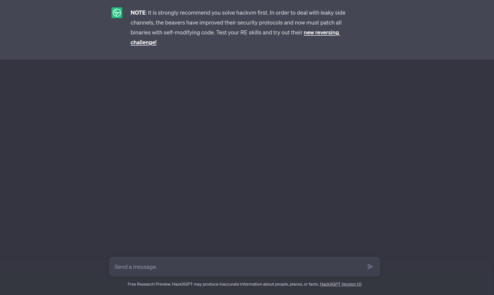
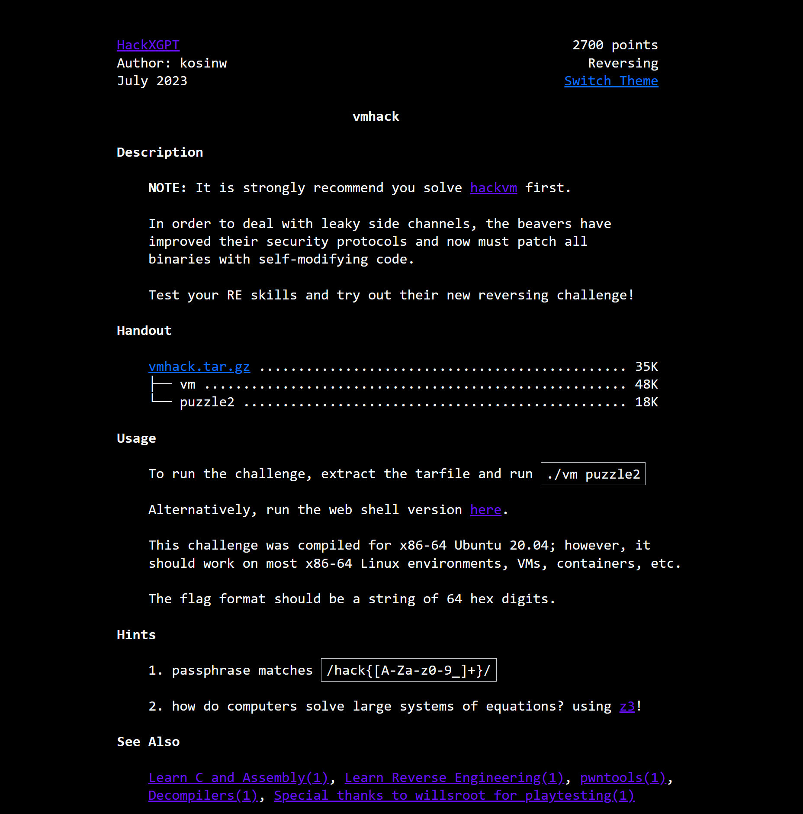
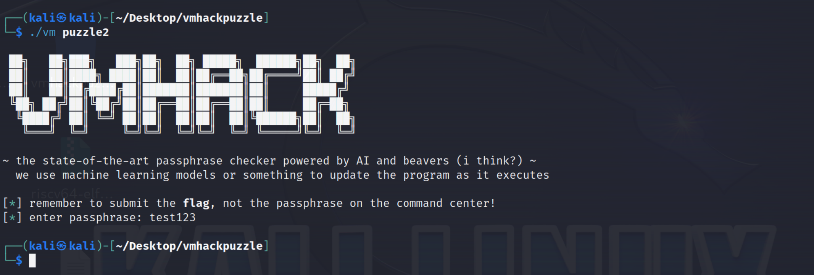
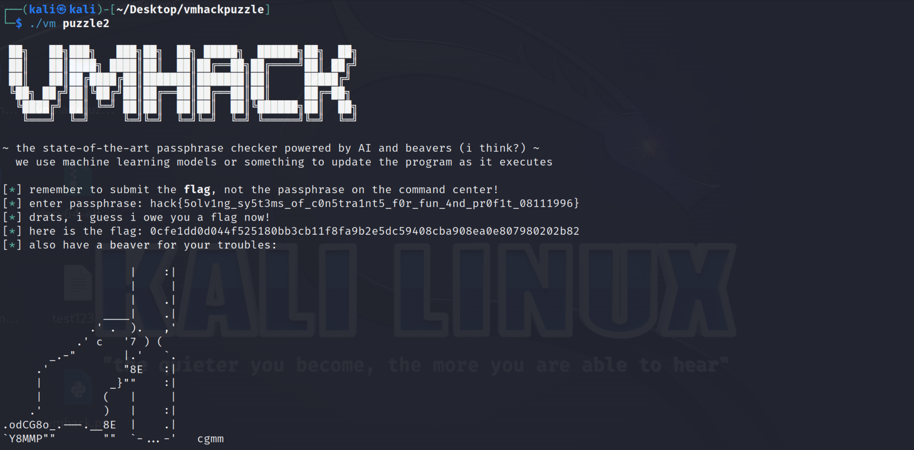

# Vmhack – Finding and Exploiting self-generated code constraints in a RISC-V32 executable with XOR-decryption, [z3](https://z3prover.github.io/api/html/z3.html) and [capstone](https://github.com/capstone-engine/capstone)

## First glance





## First thoughts

After you extracted the tar you will notice a `puzzle2` and a `vm` binary, such as in [hackvm](./../hackvm/). We can just go and execute the binaries as shown by the instructions on the web endpoint.



Huh, strange. Nothing gets printed after having entered a passphrase. After checking the file types (`file '_YOUR_FILE'`) you will notice that the `vm` and `puzzle2` binaries are again, of type ELF 64-bit and ELF 32-bit RISC-V. You will additionally notice that the `diff` command when comparing the vm binary to the vm binary of the hackvm puzzle results in no visible output, which implies that they have no difference at all and are the same. So the change must be in the `puzzle2` executable.
## First steps

Let's directly examine `puzzle2` with [Ghidra](https://ghidra-sre.org/). You can find a C-Code representation [here (puzzle2.c)](./code/puzzle2.c). All in all the code seems to be pretty similar to the hackvm `puzzle1` code. The interesting part is following.
```c
printf("[\x1b[32m*\x1b[0m] enter passphrase: ");
gets(acStack_91 + 1);
sVar1 = strlen(acStack_91 + 1);
acStack_91[sVar1] = '\0';
sVar1 = strlen(acStack_91 + 1);
if (sVar1 == 0x40) {
    (*(code *)code)(acStack_91 + 1,0x80000ea4);
    win(acStack_91 + 1);
    return 0;
}
```
First, user input is being taken along with the length of the user input which are stored at/in `acStack_91 + 1` and `sVar1`, respectively. If the user input length equals `0x40` (64 in decimal), first a weird pointer to a function is dereferenced and called with the user input and a constant value of `0x80000ea4`. Afterwards, the `win` function is executed and zero (success) is returned. We can try setting our arbitrary-passphrase length to 64 which will still result in the same output that we got before. This implies that, as the win function prints something to stdout, the `exit` syscall (a function that directly interacts with the OS kernel) has to be called somewhere in the weird dereferenced code function. Though, in our converted Ghidra-C-Code, there isn't any function like that anywhere. This means that we have to dive in into the [Assembly](https://en.wikipedia.org/wiki/Assembly_language). We can do that by downloading the riscv32 toolchain and using the corresponding GDB (GNU Debugger; use `riscv32-unknown-linux-gnu-gdb puzzle2`). You will find a good RISC-V32 instruction set reference [here](https://inst.eecs.berkeley.edu/~cs61c/resources/su18_lec/Lecture7.pdf). When disassembling the main function by entering `disas main` as a GDB command (output [here (main.s)](./code/main.s)) we find some interesting assembly lines:
```assembly
0x8000014c <+168>:   addi    a1,a1,-348 # 0x80000ea4
0x80000150 <+172>:   mv      a0,sp
0x80000154 <+176>:   auipc   ra,0x1
0x80000158 <+180>:   jalr    -756(ra) # 0x80000e60 <code>
```
We first subtract 348 from the first least-significant 12 bits of the value saved in the 32-bit register `a1`. In RISC-V assembly, this register is being used as input to the second parameter of functions, shortly before calling them. GDB tells us already the value in `a1` after having completeted the operation: `0x80000ea4`. The same value we saw given as a second parameter to the dereferenced function pointer code in our Ghidra-C-Code.

Afterwards, we move the value that is stored in the `sp` (stack pointer) register, which at that moment contains the base address of the location where the input the user gave to the program is stored, to the `a0` register. `a0` is used as input to the first parameter of functions and that also checks out with our Ghidra code.

The `auipc` instruction can be translated to "add upper immediate to program counter" and adds 1 to the most significant 20 bits of the value stored in the `pc` (program counter) register (which always contains the current instruction address) and saves the result in the `ra` (return address) register (which is used to indicate to which address the program should return to after having called a function).

The `jalr` instruction afterwards means "jump address location register" which first saves the `ra` value in a temporary register, assigns the `ra` register value to be `pc + 4` and eventually sets the program counter to the value in the previous-`ra`-value temporary register subtracted by 756 which, GDB tells us, evaluates to being the address `0x80000e60` aka `code` (note also that `code` is located inside an unatural code segment (in contrary to `.text` where normally all instructions are located) called `.crypto` which you will see after having entered the `i file` GDB command). The new `pc` value means that the next instruction to be executed is exactly at address `0x80000e60`.

The `auipc` + `jalr` instruction combination is saying that we should first jump to the address of `code` and afterwards return to the instruction after the `jalr` instruction aka continue in the main function. If you want to know details about why that requires 2 instructions, check out the [RISC-V32 instruction reference](https://inst.eecs.berkeley.edu/~cs61c/resources/su18_lec/Lecture7.pdf) I linked. This means something that the program meta data describes as `code` is being executed now. Keep the base address `0x80000e60` of `code` in mind. Let's check it out! We can do that by typing `x/25i 0x80000e60` (which translates to e**x**amine the first 25 **i**nstructions at address 0x80000e60) into the running riscv32 gdb session and checking out the result that should consist of instructions.
```assembly
0x80000e60 <code>:           lbu     a5,44(a0)
0x80000e64 <code+4>:         lbu     a3,59(a0)
0x80000e68 <code+8>:         li      a4,48
0x80000e6c <code+12>:        mv      a2,a1
0x80000e70 <code+16>:        and     a5,a5,a3
0x80000e74 <code+20>:        beq     a5,a4,0x80000e80 <code+32>
0x80000e78 <code+24>:        li      a7,93
0x80000e7c <code+28>:        ecall
0x80000e80 <code+32>: {...}
```
Here we see that, first, the byte at the address with an offset of 44 from the value stored in `a0` is loaded into the `a5` register and the same happens with a destination register of `a3` and an offset of 59. Remember that `a0` stores the base address of the entered passphrase / input which implies that `44(a0)` is equivalent to `input[44]` and `59(a0)` to `input[59]`, i.e. the 45th and 60th character in our input passphrase, which are now stored in registers `a5` and `a3`, respectively.

Afterwards, we load the 32-bit value 48 into the `a4` register and move the value stored in `a1` (our strange second parameter value of `0x80000ea4`) into the `a2` register. Now it gets interesting. We [`bitwise and`](https://en.wikipedia.org/wiki/Bitwise_operations) the values in registers `a5` and `a3` (which store the 60th and 45th character of our input) and save the result in the `a5` register. The succeeding `beq` instruction can be translated to "move to the address `0x80000e80` if the values in `a5` (our `bitwise and` result) and `a4` (the value 48) are equal". If that **isn't** the case we continue with the instruction at `0x80000e78`, move the value 93 into `a7` and make a call to an instruction called `ecall`. `ecall` causes a system call, with a determining value of the type of the system call stored in `a7`. The value 93 in `a7` characterizes the *exit system call*. **That means what this code section is actually saying is:**
```c
// pseudo code
if(input[44] & input[59] != 48) {
    exit(failure_exit_code);
}
```
If this operations actually results in 48, we continue with the next instructions from the address to which we jumped through the `beq` instruction.
```assembly
0x80000e80 <code+32>:        lui     a4,0xe681
0x80000e84 <code+36>:        addi    a4,a4,428
0x80000e88 <code+40>:        lw      a5,4(a1)
0x80000e8c <code+44>:        addi    a1,a1,4
0x80000e90 <code+48>:        xor     a3,a5,a4
0x80000e94 <code+52>:        sw      a3,0(a1)
0x80000e98 <code+56>:        bne     a5,a4,0x80000e88 <code+40>
0x80000e9c <code+60>:        addi    a2,a2,4
0x80000ea0 <code+64>:        jr      a2
0x80000ea4 <code+68>:        unimp
0x80000ea6 <code+70>:        unimp
0x80000ea8 <code+72>:        .4byte  0xe5d562f
0x80000eac <code+76>:        .4byte  0xf1d572f
0x80000eb0 <code+80>:        .8byte  0xe6d97bf0d2816bf
0x80000eb8 <code+88>:        .byte   0x1f, 0xd6, 0xbf, 0x0e, 0xcf, 0x97
0x80000ebe <code+94>:        .4byte  0x193f0e8f
```
We immediately notice that until the `unimp` instructions the instructions look like some logic is happening. The `unimp` instructions are just both 16-bits (look at the addresses and their difference) filled with zeros. After, from the address `0x80000ea8`, the rest seems to be just binary rubbish.

The first 2 instructions load `0x0e6811ac` into the `a4` register (`0xe681000 + 428`; `428` is decimal). Afterwards, we load whatever is at the address 4 added to the value we gave as a second parameter in `a1` (`0x80000ea4`) into the `a5` register and update the `a1` register value by also adding 4 to it. That means now the value in the `a1` register is `0x80000ea4 + 4` = `0x80000ea8` and in the `a5` register *whatever is stored at the address* `0x80000ea4 + 4` = `0x80000ea8` (doesn't this remind you of the binary rubbish base address?). That means we treat the second parameter we provided to the function as an address.

After, we [XOR](https://en.wikipedia.org/wiki/Bitwise_operation#XOR) the value in `a4` (`0xe681428`) with the value in `a5` (32-bits at address `0x80000ea8`) and save the result in the `a3` register. Then, set the 32 bits at the address stored by `a1` (`0x80000ea8`) to the xored value in `a3`. If the value in `a5` (the 32 bits at address `0x80000ea8`) is *not* equal to the constant value with which we xored the memory at (`0x80000ea8`), we jump *back* to the address `0x80000e88`. That means we are in a conditional loop!! And when the value in `a5` (current 32 bits) is equal to the strange constant value in `a4`, we exit the loop, add 4 to the value stored in `a2` (remember that it just is our second initial parameter) and jump to the address stored in `a2`, which is now `0x80000ea8`! To make it more understandable, I'll transform this whole block into *Pseudo*-C-Code.
```c
// pseudo code
// int32_t is the type of a 32 bit integer
// we copy secondParameter(a1) to an integer called currentAddress for the sake of readability
// secondParameter is assigned to 0x80000ea4 and of type int32_t

int32_t currentAddress = secondParameter /*a1*/;
int32_t nextAddress /*a2*/ = currentAddress;
int32_t magicValue /*a4*/ = 0x0e6811ac;

do {
    currentAddress += 4;
    int32_t currentBinaryRubbish /*a5*/ = memory[currentAddress];
    memory[currentAddress] = currentBinaryRubbish ^ magicValue;
} while(memory[currentAddress] != magicValue);

nextAddress += 4;
execute(memory[nextAddress])
```

That means in this loop we continously add 4 to the current address stored in `a1`, xor the 32-bits at the updated address with our strange value `0x0e6811ac` in `a4`, and continue until the 32 bits at the current memory location are equal to the value `0x0e6811ac` itself! Notice that the 32 bits in memory still get xored with the magic value when both are equal and because the result of a number when xored with itself is always 0 the 32 bits in memory will be zero after that point.
 Afterwards, we are *executing* the memory we just updated, meaning we are executing the instructions we just *created* or *generated* by XORing / XOR-decrypting memory in the `code` section! That's why the code segment we are in is called `.crypto`. Quite intriguing, right?

 Let's do this decrypting process manually by first e**x**amining the memory from the address `0x80000ea8` to the point where it equals our strange value `0x0e6811ac`. It becomes clear that the first 18 32-bit values are being modified as our magic value in the `a4` register is located at an offset of 17 * 32 bits from our starting address `0x80000ea8`. The command `x/18wx 0x80000ea8` (e**x**amine first 18 **w**ide he**x** (32-bit hex) values from address 0x80000ea8) yields:
```
0x80000ea8 <code+72>:   0x0e5d562f      0x0f1d572f      0x0d2816bf      0x0e6d97bf
0x80000eb8 <code+88>:   0x0ebfd61f      0x0e8f97cf      0x0bb8193f      0x0e6811df
0x80000ec8 <code+104>:  0x18d3969b      0x2e5f16bf      0x0e2db62f      0x0e2d943f
0x80000ed8 <code+120>:  0x0e8fd71f      0x0ebdb18f      0xf08f894f      0x0e2e17bf
0x80000ee8 <code+136>:  0x0e6e11cb      0x0e6811ac
```
Let's just XOR (XOR-decrypt) those values with our constant `0x0e6811ac` and interpret the result as RISC-V32 instructions. We can do that conversion either by *patching the executable* or using a python library called `capstone`. You can access the capstone script I created for that purpose [here (capstone_xordecrypt.py)](./code/capstone_xordecrypt.py).

Output:
```assembly
0x80000ea8: lbu a5, 3(a0)
0x80000eac: lbu a3, 0x17(a0)
0x80000eb0: addi a4, zero, 0x34
0x80000eb4: mv a2, a1
0x80000eb8: xor a5, a5, a3
0x80000ebc: beq a5, a4, 0xc
0x80000ec0: addi a7, zero, 0x5d
0x80000ec4: ecall
0x80000ec8: lui a4, 0x16bb8
0x80000ecc: addi a4, a4, 0x203
0x80000ed0: lw a5, 4(a1)
0x80000ed4: addi a1, a1, 4
0x80000ed8: xor a3, a5, a4
0x80000edc: sw a3, 0(a1)
0x80000ee0: bne a5, a4, -0x10
0x80000ee4: addi a2, a2, 4
0x80000ee8: jr a2
```
Nice. This looks quite similar to our previous block, doesn't it? It even has the same amount of lines! Let's take a deeper look onto the changes. Instead of "bitwise anding" `input[44]` and `input[59]` we do a XOR of `input[3]` and `input[0x17]` and compare it to `0x34`. That means our next *constraint* to validate the input by the user is in C-pseudo code:
```c
// pseudo code
if(input[3] ^ input[0x17] != 0x34) {
    exit(failure_exit_code);
}
```
If our input passphrase passes that constraint, we'll do the sasme Pseudo-C-Code loop again just with our magic value being now `0x16bb8203`. That's it.

Remember that `a1` after having executed the previous 17-instructions-block now stores the address of the last 32-bits in memory we xored with the magic value of `0x16bb8203`. These were the magic value itself, are now set to zero and located at address `0x80000ee8 + 4` = `0x80000eec`. Now, we would do the XOR-decryption process until the next contiguous 32-bits of memory are equal to the magic value again, starting with the base address `0x80000eec + 4` = `0x80000ef0`, 4 bytes after our "zeroed-out" last magic value bits. A little spoiler: the next decrypted block will contain a new constraint and a new xor-magic value again and be of the same format as our previous blocks which means it has the same amount of contiguous 32-bit values (instructions): 17. For a 64 bit passphrase there will have to be many constraints to uniquely validate it with each constraint making up just a relation between members of a pair of distinct characters. That's why we should automate the whole process. Let's summarize what we assume to hold for all values and blocks in the `code` section.

**Format:**
```
Instruction block of size 17 instructions
32 zero-bits
Encrypted instruction block of size 17 instructions
32-bit MAGIC VALUE (it gets converted to 32 zero bits after decryption)

{This pattern continues (assumption).}
```
where in each instruction block there is a constraint which is used to validate user input. We can assume that there is only one input/passphrase character sequence that fulfills all the contraints and our prerequesites from the web endpoint.
#### Plan

**So**, the plan is following. We will step into the implementation process now, decrypt each instruction block by using the respective magic value which is directly located after the next encrypted 17 instructions and exactly 32-bits long. We will do that until the pattern changes. We are saving the bytes of the decrypted instructions and continuing with disassembling those bytes with capstone using the RISCV-32 engine and parsing the constraints. Finally, we will use use a SAT-engine (z3) and program it to find possible character sequences matching the regex that was provided by the web app that satisfy all of our found constraints.
## Implementation

To copy all the bytes in the code section in an appropriate format, we'll use a local installation of Ghidra (it is installed by default on Kali Linux). You can do the following steps.
```text
1. Launch Ghidra and open a new project consisting of the puzzle2 binary.
2. Program Trees (On the right) > puzzle2 > .crypto
3. Symbol Tree (On the right) > Labels > code > {Right Click} > Make Selection
4. {Right Click on the highlighted area} > Copy Special > Byte String (No Spaces)
5. Paste the bytes into a file.
```
You can see the result [here](./logs/bytes.txt). Each 2 contiguous hex digits represent a byte. We can use this representation to decrypt the instructions. I did that with Java, you can find the program [here (XorDecryptor.java)](./code/XorDecryptor.java) where I just converted the `code` section bytes in `bytes.txt` to a format suitable for being pasted into a `bytes object` in python for capstone.
```text
Format:
Each 32 bit instruction is represented like the following.
\x23\x23\x23\x23
Each digit represents a hex digit or 4 bits.
```
We have to consider an architecture-dependent trap here. Each multi-byte data type is stored on modern systems in [Little Endian](https://en.wikipedia.org/wiki/Endianness) which means that the least significant byte is stored first or the bytes (*Attention*: **not** the bits) are sorted by significance in ascendent order.
```
Example 1:

Let's say we have a 32-bit integer: int i = 2
This is 0x00000002 in hex with padded zeros.
In memory, the bytes are stored in "reverse" order on Little Endian systems.
As 2 hex digits describe 1 byte the byte-representation for the int32 is:
0x00 0x00 0x00 0x02
It is represented like the following in memory on Little Endian systems:
0x02 0x00 0x00 0x00

Example 2:

The integer 0xdeadbeef is stored in memory on Little Endian systems as [0xef, 0xbe, 0xad, 0xde].
```
Let's enter the command `file puzzle2` into our terminal again.
```
Output:
puzzle2: ELF 32-bit LSB executable, UCB RISC-V, soft-float ABI, version 1 (SYSV), statically linked, not stripped

LSB means "Least Significant Byte" and is nothing else than determining that our executable uses Little Endianness!
MSB means "Most Siginficant Byte" (Big Endian) and is analogously defined, the most siginficant byte is stored first in memory.
```
The same happens to our instructions in memory when saved (as all instructions are multi-byte data on 32-bit systems) which is why I had to "reverse" the order of bytes before printing them in our [java file (XorDecryptor.java)](./code/XorDecryptor.java) which you will be able to observe below the comment `// REVERSE SECTION`. We can execute the `XorDecryptor.java` now.
```
Output (Java File):

\x83\x47\xc5\x02\x83\x46\xb5\x03\x13\x07\x00\x03\x13\x86\x05\x00\xb3\xf7\xd7\x00\x63\x86\xe7\x00\x93\x08\xd0\x05\x73\x00\x00\x00\x37...{TRUNCATED}
Last bytes after the pattern changed: \x67\x80\x00\x00
```
After using capstone to convert those last pattern-breaking bytes to RISC-V32 instructions, we get that it actually represents the `ret` ("return") instruction which will be the only way for us to continue in the `main` function and execute the `win` function next. We only get there if our passphrase input passed all the constraints, in any other way the program will exit. Now that we have all the decrypted instructions ready, let's build a python script that parses the constraints with capstone. I already finished a [script (vmhack.py)](./code/vmhack.py) that directly converts all the instructions into valid constraints in the form `s.add(pw[index1] operation [index2] == result)` that we are able to add to an SAT solver. In our case we will use z3.

Don't fear, reading z3 is pretty self-explanatory. We create a solver and just plug in all of the information we know about the passphrase.
```
--WANTED--
Name: passphrase
Length: 64
Matches: regex /hack{[A-Za-z0-9_]+}/
Constraints: execute vmhack.py to see more
```
You'll find a commented script [here (z3vmhacksolve.py)](./code/z3vmhacksolve.py). (Note that you will have to manually install z3 from their [github repository](https://github.com/Z3Prover/z3) for it to run on your computer!!) Let's execute it by entering `python z3vmhacksolve.py` into our terminal...
```
Output:

hack{5olv1ng_sy5t3ms_of_c0n5tra1nt5_f0r_fun_4nd_pr0f1t_08111996}
```
...*voilà.* Now we can just copy-paste the passphrase into the `puzzle2` program.



> **Note**
> I could have done all of that in one python script. While I was working on the problem my problems was that I switched between my Kali Linux vm and my actual home environment for many times and ended up building different scripts on different environments and in different languages. Quite of a chaos.

> **Note**
> I recommend checking out the [pwntools](https://docs.pwntools.com/en/stable/) framework. It facilitates many processes in the domain of Pen-Testing and especially in RE.
## Conclusion
We learned about RISC-V32 ELF executables, how to disassemble them with the riscv32 toolchain, some basics about how they are written in Assembly and how self-generating code might be implemented. We learned how to carefully analyze executables, about XOR-Encryption, Ghidra, how to automate instruction-reading for many different architectures in python with capstone, solving systems of constraints in python with z3, about things, such as little endian and its popularity nowadays and code segments such as .text and unnatural ones, such as the .crypto section here. This was the hardest puzzle of HackMIT 2023, congratulations!